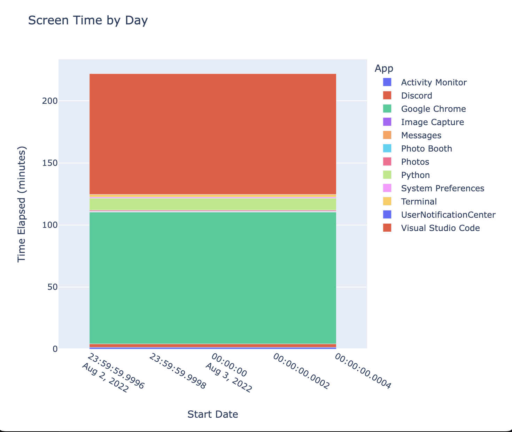

# Screen Time
Screen time is a cross-platform app to display the user's daily computer usage. The app aims to help make people more aware of the amount of time they spend on the computer. This issue became increasingly important to me once I realized most of my day was spent on games, and not being productive.

Each time you switch windows on your computer, a new entry is added into a local database. This entry contains the app you were using, the start date, the end date, and the total seconds elapsed.

*Disclaimer: This project was built as a portfolio project and has no intent of being used in a professional manner.*

## Installation
To install, first create a virtual enviornment:
```
python3 venv -m screentime-env
```
Activate it:
```
source screentime-env/bin/activate
```
Then, install the requirements from `requirements.txt`:
```
pip3 install -r requirements.txt
```
Finally, you can run the main application:
```
python3 main.py
```

## How to use
As of right now, the app is in two seperate programs. The `main.py` file is the guts of the program. It logs entries into the local database and monitors user behavior.

The `data_view.py` file allows a user to visualize data into a chart via plotly. (See below)



---
## Credits
- [SO: Obtain Active Window using Python](https://stackoverflow.com/questions/10266281/obtain-active-window-using-python)